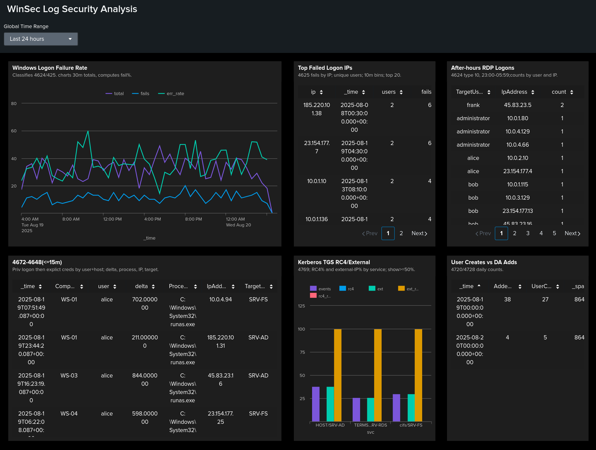

# Splunk WinSec Log Security Analysis

Windows Security case in Splunk: 6 checks + a dashboard for rapid triage of login anomalies, risky RDP, privilege escalation, weak Kerberos usage, and high-impact account changes. Structure and delivery follow the referenced Okta repo by the same author.

**Files**
- Full report (DOCX): **[WinSec_Logs_report.docx](WinSec_Logs_report.docx)**
- Dashboard: **[Dashboard_winsec.png](Dashboard_winsec.png)**

---

## Data and Fields
Windows Security events: **4624, 4625, 4648, 4672, 4720, 4728, 4769**.  
Key fields: `EventCode`, `TargetUserName`, `SubjectUserName`, `IpAddress`, `LogonType`, `Computer`, plus XML parsing via `spath`.  
Default time range: last 24 hours.

---

## Dashboard

**Purpose.** A single screen to catch spikes in login errors, spraying from a single IP, after-hours RDP, rapid 4672→4648 chains, RC4 usage in Kerberos, and Domain Admin additions.

**Global filters.** Time range, computer/host, user, IP. Panels update in sync with these filters.

**Panels**
1. **Windows Logon Failure Rate** — trend of total/fail and `err_rate` in 30-minute bins. Spikes = spraying or misconfig.  
2. **Top Failed Logon IPs** — sources with the most fails and most distinct targeted users.  
3. **After-hours RDP Logons** — successful RDP (`LogonType=10`) from 23:00–06:00.  
4. **4672→4648 (≤15m)** — explicit-credential logon shortly after special-privilege assignment on the same host/user.  
5. **Kerberos TGS RC4/External** — per service: RC4 share and external-source share.  
6. **User Creates vs DA Adds** — trends of user creations and Domain Admin additions.

**How to use.**
- Start with panel 1, mark windows with abnormal `err_rate`, then drill into sources in panel 2.  
- For after-hours RDP, verify justification, MFA, and bastion use.  
- For 4672→4648, inspect `ProcessName` and target servers.  
- For RC4 and external requests, migrate ciphers and limit service exposure.  
- Any DA addition requires immediate review and ticket validation.

**KPIs/thresholds.**
- `err_rate` > baseline by **+3σ** for ≥60 minutes.  
- Spraying: a single IP with ≥N fails across ≥M users within ≤15 minutes.  
- Any after-hours RDP, except allowlisted bastions/service accounts.  
- 4672→4648 within ≤15 minutes per user-host.  
- Per service: **RC4% ≥50%** or **external% ≥50%**.  
- Any Domain Admin addition; spikes in user creations outside change windows.

---

## Checks and Findings

### 1) Authentication Failure Rate Over Time
**Purpose:** Quantify FAIL/SUCCESS ratio and spot spikes.  
**Finding:** Sustained `err_rate` peaks indicate spraying or misconfig; alignment with release windows is often benign.  
**Recommendation:** Alert on deviation from baseline (+3σ, ≥60m). Pivot to IPs and accounts from panel 2 or raw events.

### 2) Top Source IPs for Failed Logons
**Purpose:** Identify IPs generating many fails across many users.  
**Finding:** One IP targeting many accounts; public IPs are higher risk than internal.  
**Recommendation:** Enrich, geolocate, check reputation. Block or throttle per policy; enforce MFA resets if needed.

### 3) After-hours RDP Logons
**Purpose:** Find successful RDP outside business hours.  
**Finding:** Unusual user–IP pairs at night suggest valid-account misuse.  
**Recommendation:** Require business justification, ensure MFA, restrict RDP to approved bastions.

### 4) 4672 → 4648 (≤15m)
**Purpose:** Detect privilege escalation patterns after special-privilege assignment.  
**Finding:** Short deltas and unusual `ProcessName`/`TargetServerName` increase risk.  
**Recommendation:** Alert when 4648 follows 4672 within 15 minutes on the same user-host. Review process lineage and target access.

### 5) Kerberos TGS: RC4 and External Sources
**Purpose:** Find services with legacy crypto and external requests.  
**Finding:** Services with RC4% ≥50% or external% ≥50% are weak or exposed.  
**Recommendation:** Migrate to AES, limit external reachability, review SPNs, rotate keys if required.

### 6) New Accounts and Domain Admin Additions
**Purpose:** Control high-impact identity changes.  
**Finding:** Spikes outside change windows and any DA addition require immediate investigation.  
**Recommendation:** Alert on any DA addition. Enforce strict ticket validation. Investigate bursts of new users and roll back unauthorized changes.

---

## Result
A repeatable Splunk hunting workflow for WinSec: six targeted checks plus a dashboard enable fast triage, clear alert thresholds, and actionable steps. Full steps with screenshots are in **WinSec_Logs_report.docx**. Visual summary is in **Dashboard_winsec.png**.
